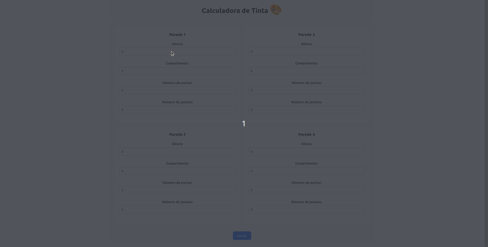

Este projeto é uma calculadora de tinta que ajuda a calcular a quantidade de tinta necessária para pintar paredes, considerando portas e janelas. O projeto é composto por um frontend em React e um backend em Node.js.

<p align='center'>

</p>

## Funcionalidades

- Calcula a quantidade de tinta necessária para pintar até quatro paredes.
- Fornece sugestões de latas de tinta com base no cálculo.

## Tecnologias Utilizadas

- Frontend: React, TypeScript, Vite
- Backend: Node.js, Express
- Docker

## Configuração do Ambiente de Desenvolvimento

### Pré-requisitos

- Node.js
- Docker
- Docker Compose

### Clonando o Repositório

```bash
git clone git@gitlab.com:lucasvtf1/code-challenge.git
cd code-challenge
```

### Rodando o projeto com Docker.

```bash
docker-compose up --build
```

O frontend estará disponível em http://localhost:3000 e o backend em http://localhost:8000

